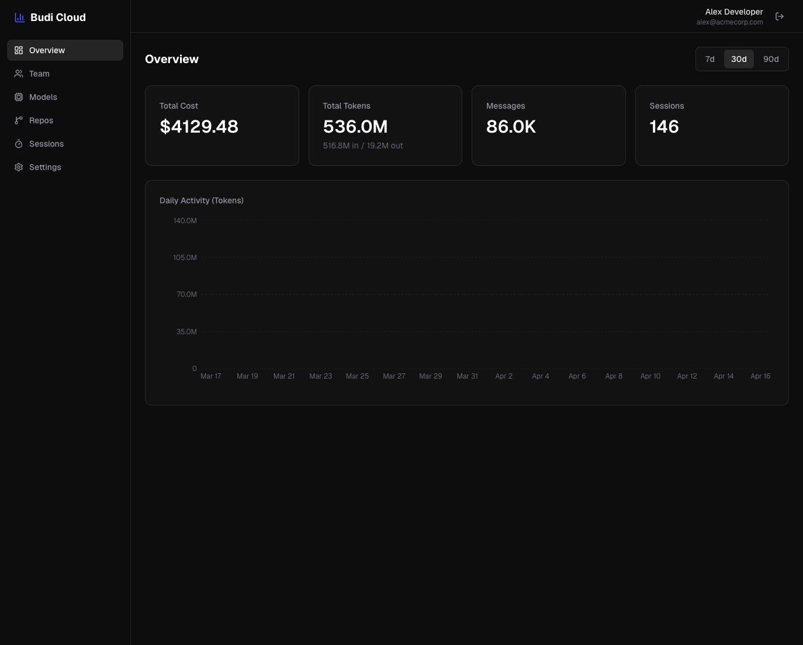
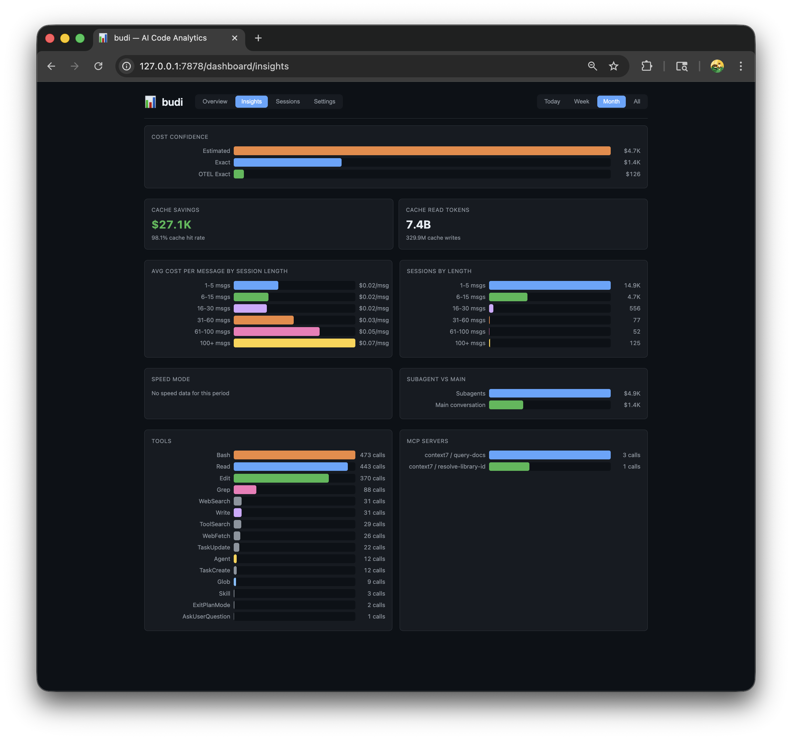
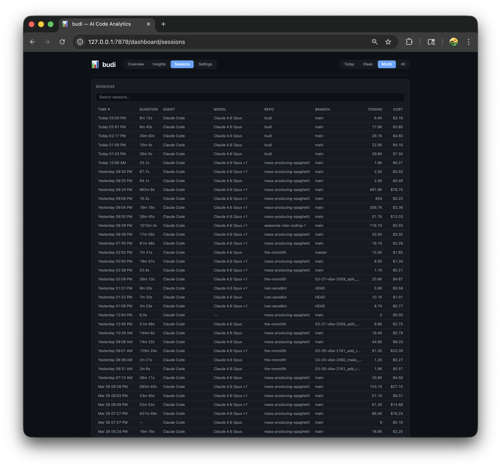

# budi

[](https://github.com/siropkin/budi/actions/workflows/ci.yml)
[](https://github.com/siropkin/budi/releases/latest)
[](https://github.com/siropkin/budi/blob/main/LICENSE)
[](https://github.com/siropkin/budi)

**Local-first cost analytics for AI coding agents.** See where your tokens and money go across Claude Code, Cursor, and more.

```bash
brew install siropkin/budi/budi && budi init
```

Everything stays on your machine by default. Optional cloud sync pushes aggregated daily cost metrics to a team dashboard at `app.getbudi.dev` — prompts, code, and responses never leave your machine.

<p align="center">
  
</p>

<details>
<summary>More screenshots</summary>

**Insights** — cache efficiency, session cost curve, tool usage, subagent costs

<p align="center">
  
</p>

**Sessions** — searchable session list with drill-down to individual messages and session health

<p align="center">
  
</p>

</details>

## What it does

- Tracks tokens, costs, and usage per message across AI coding agents
- **Local proxy** (port 9878) sits between your agent and the LLM provider, capturing every request in real time — streaming responses pass through with no visible lag
- Attributes cost to repos, branches, tickets, and custom tags
- **Session health** — detects context bloat, cache degradation, cost acceleration, and retry loops with actionable, provider-aware tips
- **Cloud dashboard** at [`app.getbudi.dev`](https://app.getbudi.dev) — team-wide cost visibility across users, repos, models, branches, and tickets (daily granularity, requires `budi cloud join`)
- Live cost + health status line in Claude Code and Cursor
- **One-time import** of historical transcripts via `budi import` (Claude Code JSONL, Codex Desktop/CLI sessions, Copilot CLI sessions, Cursor Usage API)
- ~6 MB Rust binary, minimal footprint

## Platforms

budi targets **macOS**, **Linux** (glibc), and **Windows 10+**. Prebuilt release binaries are published for macOS (Intel + Apple Silicon), Linux (x86_64 + aarch64 glibc), and Windows x86_64. On Windows ARM64, the installer currently uses the x86_64 binary via emulation. Paths follow OS conventions (`HOME` / `USERPROFILE`, data under `~/.local/share/budi` on Unix and `%LOCALAPPDATA%\budi` on Windows). Daemon port takeover after upgrade uses `lsof`/`ps`/`kill` on Unix and **PowerShell `Get-NetTCPConnection`** plus `taskkill` on Windows (requires PowerShell, which is default on supported Windows versions).

## Supported agents

| Agent | Tier | Status | How |
|-------|------|--------|-----|
| **Claude Code** | Tier 1 | Supported | Auto-configured by `budi init` (shell profile env block) |
| **Codex CLI** | Tier 1 | Supported | Auto-configured by `budi init` (shell profile env block + Codex Desktop config patch) |
| **Cursor** | Tier 2 | Supported | Auto-configured by `budi init` (Cursor settings.json patch) |
| **Copilot CLI** | Tier 2 | Supported | Auto-configured by `budi init` (shell profile env block) |
| **Gemini CLI** | Tier 3 | Deferred | Different API format; not supported in v1 proxy |

Tier 1 agents use simple env vars with high confidence. Tier 2 agents work but have onboarding caveats (GUI settings, proprietary env vars). See [ADR-0082](docs/adr/0082-proxy-compatibility-matrix-and-gateway-contract.md) for the full compatibility matrix.

All agents also support one-time historical import via `budi import` (Claude Code JSONL transcripts, Codex Desktop/CLI sessions, Copilot CLI sessions, Cursor Usage API).

## Contributing

See [CONTRIBUTING.md](CONTRIBUTING.md) for local setup, quality checks, and PR workflow.
Architecture and module boundaries are documented in [SOUL.md](SOUL.md).
Architecture decision records live in [`docs/adr/`](docs/adr/).

Quick validation: `cargo fmt --all && cargo clippy --workspace --all-targets --locked -- -D warnings && cargo test --workspace --locked`

Cursor extension and cloud dashboard live in their own repos: [`siropkin/budi-cursor`](https://github.com/siropkin/budi-cursor), [`siropkin/budi-cloud`](https://github.com/siropkin/budi-cloud).

To report a bug or request a feature, open a GitHub issue using the repository templates so maintainers get reproducible details quickly.

## Install

Use Homebrew if you have it. Otherwise use the shell script (macOS/Linux) or PowerShell script (Windows). Build from source only if you want to contribute.

**Homebrew (macOS / Linux):** requires [Homebrew](https://brew.sh/)

```bash
brew install siropkin/budi/budi && budi init
```

**Shell script (macOS / Linux):** requires `curl` and `tar` (glibc-based systems only; Alpine/musl users should build from source)

```bash
curl -fsSL https://raw.githubusercontent.com/siropkin/budi/main/scripts/install-standalone.sh | bash
```

**Windows (PowerShell):** requires PowerShell 5.1+

```powershell
irm https://raw.githubusercontent.com/siropkin/budi/main/scripts/install-standalone.ps1 | iex
```

Windows notes: binaries install to `%LOCALAPPDATA%\budi\bin`. Stopping or upgrading the daemon uses `taskkill` (or PowerShell) instead of Unix `pkill`. On startup, budi-daemon asks PowerShell for listeners on its port and terminates another `budi-daemon` if present. PATH is updated in the user environment — restart your terminal after install.

**From source:** requires [Rust toolchain](https://rustup.rs/)

```bash
git clone https://github.com/siropkin/budi.git && cd budi && ./scripts/install.sh
```

Windows source build (PowerShell):

```powershell
git clone https://github.com/siropkin/budi.git
cd budi
cargo build --release --locked
$BinDir = Join-Path $env:LOCALAPPDATA "budi\bin"
New-Item -ItemType Directory -Path $BinDir -Force | Out-Null
Copy-Item .\target\release\budi.exe $BinDir -Force
Copy-Item .\target\release\budi-daemon.exe $BinDir -Force
& (Join-Path $BinDir "budi.exe") init
```

**Or paste this into your AI coding agent:**

> Install budi from https://github.com/siropkin/budi following the install instructions in the README

`budi init` behavior by install method:

| Method | Runs `budi init` automatically? |
|---|---|
| Homebrew (`brew install ...`) | No — run `budi init` manually |
| Standalone shell script (`curl ... \| bash`) | Yes |
| Standalone PowerShell script (`irm ... \| iex`) | Yes |
| From source (`./scripts/install.sh`) | Yes |

If you install with Homebrew, run `budi init` right after `brew install`.

**One install on PATH.** Do not mix Homebrew with `~/.local/bin` (macOS/Linux) or with `%LOCALAPPDATA%\budi\bin` (Windows): you can end up with different `budi` and `budi-daemon` versions and confusing restarts. Keep a single install directory ahead of others on `PATH` (or remove duplicates). `budi init` warns if it detects multiple binaries.

`budi init` starts the daemon (port 7878) and proxy (port 9878), and **prompts you to choose which agents to track** (Claude Code, Cursor, Codex CLI, Copilot CLI) and **which integrations to install** (statusline, extension). Agent choices are stored in `~/.config/budi/agents.toml`. In non-interactive mode it uses safe defaults (all agents enabled). You can also choose integrations explicitly with flags like `--with`, `--without`, and `--integrations all|none|auto`.

During init, budi automatically applies proxy routing for selected agents:
- CLI agents (Claude/Codex/Copilot): injects a managed env-var block into your shell profile (`~/.zshrc`, `~/.bashrc`, or `~/.bash_profile`)
- Cursor: patches Cursor settings.json with the proxy base URL
- Codex Desktop: patches `~/.codex/config.toml` with `openai_base_url`

`budi launch <agent>` still works as an explicit fallback. For a one-off bypass, run `BUDI_BYPASS=1 budi launch <agent>`.

**Important:** After `budi init` or `budi enable`, restart your terminal so the shell-profile proxy env vars take effect for CLI agents (Claude Code, Codex, Copilot). Already-running sessions are NOT going through the proxy until the shell is restarted. For immediate proxy routing without restart, use `budi launch <agent>`. `budi doctor` detects when proxy env vars are configured but not active in the current shell. Customize ports in the **repo-local** `config.toml` under `<budi-home>/repos/<repo-id>/config.toml` (run `budi doctor` inside the repo to see the exact path).

To install a specific version, set the `VERSION` environment variable: `VERSION=v7.1.0 curl -fsSL ... | bash` (or `$env:VERSION="v7.1.0"` on PowerShell).

Run `budi doctor` to verify everything is set up correctly.

### First run checklist (5 minutes)

Use this sequence if you want the fastest "did setup really work?" path:

1. **Install and initialize**
   - Homebrew: `brew install siropkin/budi/budi` then `budi init`
   - Standalone installers and `./scripts/install.sh` already run `budi init` for you
2. **Choose agents and integrations** during `budi init` (recommended defaults are safe)
   - `budi init` also installs a platform-native autostart service (launchd on macOS, systemd on Linux, Task Scheduler on Windows) so the daemon restarts automatically after reboots
3. **Import historical data** (optional)
   - Run `budi import` to backfill from Claude Code JSONL transcripts, Codex Desktop/CLI sessions, Copilot CLI sessions, and Cursor Usage API
4. **Confirm health**
   - Run `budi doctor` to check daemon, proxy, autostart service, and agent configuration
   - Run `budi status` for a quick overview of daemon, proxy, and today's cost
5. **Generate your first data point**
   - Open your selected agent as usual (`claude`, `codex`, `cursor`, `gh copilot`) and send a prompt
   - Optional explicit fallback: `budi launch <agent>`
   - One-off bypass for explicit launch: `BUDI_BYPASS=1 budi launch <agent>`
   - Run `budi stats` and confirm non-zero usage
6. **Restart your terminal**
   - CLI agents (Claude Code, Codex, Copilot) need a new shell session to pick up proxy env vars
   - Or use `budi launch <agent>` for immediate proxy routing without restarting
   - `budi doctor` warns if proxy env vars are configured but not active in the current shell

### PATH and duplicate binary checks

If `budi` is "not found" or behavior looks inconsistent after an update, verify which binary is being executed:

- macOS/Linux:
  - `command -v budi`
  - `which -a budi`
- Windows (PowerShell):
  - `Get-Command budi -All`

Keep only one install source first on PATH (Homebrew **or** standalone path), not both.

## Status line

Budi adds a live cost display to Claude Code (optional in `budi init`):

`🟢 budi · $4.92 session · session healthy`

The `coach` preset shows your current session cost plus a health indicator. When Budi spots a problem, the short tip explains what to do next:

`🟡 budi · $12.50 session · Context growing — /compact soon`

New sessions start green — the default is always positive:

`🟢 budi · $0.42 session · new session`

Customize slots in `~/.config/budi/statusline.toml`:

```toml
slots = ["today", "week", "month", "branch"]
```

Available slots: `today`, `week`, `month`, `session`, `branch`, `project`, `provider`.

## Cursor extension

Budi includes a Cursor/VS Code extension that shows session health and cost in the status bar and a side panel. It can be installed during `budi init` and later via `budi integrations install --with cursor-extension`.

The status bar shows today's sessions with health at a glance (`🟢 3 🟡 1 🔴 0`). Click it to open the health panel with session details, vitals, and tips.

**Manual install** (if auto-install was skipped or you want to rebuild):

```bash
git clone https://github.com/siropkin/budi-cursor.git && cd budi-cursor
npm ci && npm run build
npx vsce package --no-dependencies -o cursor-budi.vsix
cursor --install-extension cursor-budi.vsix --force
```

Then reload Cursor: **Cmd+Shift+P** → **Developer: Reload Window**.

## Update

```bash
budi update                      # downloads latest release, migrates DB, restarts daemon
budi update --version 7.1.0     # update to a specific version
```

Works for all installation methods — automatically detects Homebrew and runs `brew upgrade` when appropriate. Update refreshes integrations you previously enabled (stored in `~/.config/budi/integrations.toml`). Agent enablement is stored separately in `~/.config/budi/agents.toml`.

## Integrations

Manage integrations anytime (especially if you skipped some during first init):

```bash
budi integrations list
budi integrations install --with cursor-extension
```

**Restart Claude Code and Cursor** after updating to pick up any changes.

## CLI

**Launch and onboarding:**

```bash
budi init                          # start daemon, configure integrations
budi launch claude                 # launch Claude Code through the proxy (zero config)
budi launch codex                  # launch Codex CLI through the proxy
budi launch copilot                # launch Copilot CLI through the proxy
budi launch cursor                 # print Cursor proxy setup instructions (GUI only)
budi import                        # one-time import of historical transcripts
```

**Monitoring and analytics:**

```bash
budi status                        # quick overview: daemon, proxy, today's cost
budi stats                         # usage summary with cost breakdown
budi stats --models                # model usage breakdown
budi stats --projects              # repos ranked by cost
budi stats --branches              # branches ranked by cost
budi stats --branch <name>         # cost for a specific branch
budi stats --provider codex        # filter stats to a single provider
budi stats --tag ticket_id         # cost per ticket
budi stats --tag ticket_prefix     # cost per team prefix
budi sessions                      # list recent sessions with cost and health
budi sessions <id>                 # session detail: cost, models, health, tags
budi health                        # session health vitals for most recent session
budi health --session <id>         # health vitals for a specific session
```

**Diagnostics and maintenance:**

```bash
budi doctor                        # check health: daemon, proxy, database, config
budi doctor --deep                 # run full SQLite integrity_check (slower)
budi autostart status              # check daemon autostart service
budi autostart install             # install the autostart service
budi autostart uninstall           # remove the autostart service
budi import --force                # re-ingest all data from scratch (use after upgrades)
budi repair                        # repair schema drift + run migration checks
budi update                        # check for updates (auto-detects Homebrew)
budi update --version <name>       # update to a specific version
budi integrations list             # show what is installed vs available
budi integrations install ...      # install integrations later
budi uninstall                     # remove status line, config, and data
budi uninstall --keep-data         # uninstall but keep analytics database
```

All data commands support `--period today|week|month|all` and `--format json`.

## Tags & cost attribution

Assistant messages are tagged with core attribution keys: `provider`, `model`, `ticket_id`, `ticket_prefix`, `activity`, `composer_mode`, `permission_mode`, `duration`, `tool`, `tool_use_id`, `user_email`, `platform`, `machine`, `user`, `git_user`.

Conditional tags:
- `cost_confidence` is added when `cost_cents` is present.
- `speed` is added only for non-`standard` speed modes.

Identity tag semantics:
- `platform`: OS platform (`macos`, `linux`, `windows`)
- `machine`: host/machine name
- `user`: local OS username
- `git_user`: Git identity (`user.name`/`user.email` fallback)

`repo_id` and `git_branch` are stored as canonical message/session fields (not tags), so repo/branch analytics stay single-source and do not double-count.

Add custom tags in `~/.config/budi/tags.toml`:

```toml
[[rules]]
key = "team"
value = "platform"
match_repo = "github.com/org/repo"

[[rules]]
key = "team"
value = "backend"
match_repo = "*Backend*"
```

## Session health

Budi monitors four vitals for every active session and turns them into plain-language tips.

The scoring is intentionally conservative:
- New sessions start **green** — the default is always positive. Vitals only turn yellow or red when there is clear evidence of a problem.
- It measures the current working stretch, so a `/compact` resets context-based checks.
- It looks at the active model stretch for cache reuse, so model switches do not poison the whole session.
- Cost acceleration uses per-user-turn costs when prompt boundaries are available, and falls back to per-reply costs otherwise.
- When `budi health` runs without `--session`, it picks the latest session by assistant activity first, then falls back to session timestamps.
- It prefers concrete next steps over internal jargon.

Tips are provider-aware: Claude Code suggestions mention `/compact` or `/clear`, Cursor suggestions point you toward a fresh composer session, and unknown providers receive neutral advice. Different providers may intentionally get different recommendations for the same health issue.

| Vital | What it detects | Yellow | Red |
|-------|----------------|--------|-----|
| **Context Growth** | Context size is growing enough to add noise | 3x+ growth with meaningful absolute growth | 6x+ growth with large absolute context size |
| **Cache Reuse** | Recent cache reuse is low for the active model stretch | Below 60% recent reuse | Below 35% recent reuse |
| **Cost Acceleration** | Later turns/replies cost much more than earlier ones | 2x+ growth and meaningful cost per unit | 4x+ growth and high cost per unit |
| **Retry Loops** | Agent is stuck in a failing tool loop | One suspicious retry loop | Repeated or severe retry loops |

Health state appears in the status line, the Cursor extension panel, and the session detail page in the dashboard. Yellow means "pay attention soon"; red means "intervene now or start fresh."

## Privacy

Budi is local-first. All data stays on your machine by default (`~/.local/share/budi/` on Unix, `%LOCALAPPDATA%\budi` on Windows). The proxy forwards your requests to the upstream LLM provider and back, but budi only **stores** metadata locally: timestamps, token counts, model names, and costs. Prompts, code, and AI responses pass through the proxy and are never written to disk or retained by budi.

**Cloud sync** (optional, disabled by default) pushes pre-aggregated daily rollups and session summaries to a team dashboard at `app.getbudi.dev`. Only numeric metrics cross the wire: token counts, costs, model names, hashed repo IDs, branch names, and ticket IDs. Prompts, code, responses, file paths, email addresses, raw payloads, and tag values are structurally excluded from the sync payload — there is no "full upload" mode.

Cloud sync details:
- **Transport**: HTTPS only — the daemon refuses to sync over plain HTTP
- **Direction**: Push-only — the cloud never initiates connections to your machine; there is no webhook, pull, or remote command channel
- **Granularity**: Daily aggregates; no per-message, per-hour, or real-time streaming views
- **Retention**: 90 days in the cloud alpha
- **Team model**: Manager/member roles for small teams (1–20 developers)
- **Auth**: API key auth for daemon sync; Supabase Auth (GitHub, Google, magic link) for the web dashboard. No SSO/SAML in v1

See [ADR-0083](docs/adr/0083-cloud-ingest-identity-and-privacy-contract.md) for the complete privacy contract.

## How it works

A lightweight Rust daemon (port 7878) manages a single SQLite database. The daemon runs a **proxy server** on port 9878 that transparently forwards agent traffic to upstream providers (Anthropic, OpenAI) while capturing metadata. Streaming (SSE) responses pass through chunk-by-chunk with no buffering; token metadata is extracted from the byte stream without modifying it. Proxy traffic is attributed to repos, branches, and tickets via `X-Budi-Repo`/`X-Budi-Branch`/`X-Budi-Cwd` headers or automatic git resolution, with cost computed from provider pricing tables. Historical data from Claude Code JSONL transcripts and Cursor Usage API can be backfilled via `budi import`. The CLI is a thin HTTP client — all queries go through the daemon.

## Details

<details>
<summary>How budi compares</summary>

| | budi | ccusage | Claude `/cost` |
|---|---|---|---|
| Multi-agent support | **Yes** (Claude Code, Codex CLI, Cursor, Copilot CLI) | Claude Code only | Claude Code only |
| Real-time cost via proxy | **Yes** | No | No |
| Cost history | **Per-message + daily** | Per-session | Current session |
| Cloud dashboard | **Yes** ([app.getbudi.dev](https://app.getbudi.dev)) | No | No |
| Status line + session health | **Yes** (with actionable tips) | No | No |
| Per-repo breakdown | **Yes** | No | No |
| Cost attribution (branch/ticket) | **Yes** | No | No |
| Privacy | Local-first (optional cloud sync for aggregated metrics only) | Local | Built-in |
| Setup | `budi init` | `npx ccusage` | Built-in |
| Built with | Rust | TypeScript | — |

</details>

<details>
<summary>Architecture</summary>

```
┌──────────┐    HTTP     ┌──────────────┐    SQLite    ┌──────────┐
│ budi CLI │ ──────────▶ │ budi-daemon  │ ───────────▶ │  budi.db │
└──────────┘             │  (port 7878) │              └──────────┘
                         │              │                    ▲
                         │  - analytics │    Pipeline       │
                         │  - import    │ ──────────────────┘
                         │  (on demand) │    Extract → Normalize
                         └──────────────┘      → Enrich → Load
                                │
                         ┌──────────────┐
┌──────────┐    proxy    │ budi proxy   │    upstream
│ AI Agent │ ──────────▶ │  (port 9878) │ ──────────▶ Anthropic / OpenAI
│ (CC/CX)  │  localhost  │  transparent │  API calls
└──────────┘             │  pass-thru   │
                         └──────────────┘

Historical import (budi import):
  JSONL transcripts (Claude Code) ──┐
  JSONL sessions (Codex) ───────────┤
  JSONL sessions (Copilot CLI) ─────┼──▶ Pipeline → SQLite
  Usage API (Cursor) ───────────────┘
```

The daemon is the single source of truth — the CLI never opens the database directly. The **proxy** is the sole live data source: every LLM request flows through it, capturing tokens, cost, and attribution in real time. Historical data from Claude Code JSONL transcripts, Codex Desktop/CLI sessions, Copilot CLI sessions, and Cursor Usage API can be imported via `budi import` for one-time backfill.

**Data model** — nine tables, seven data entities + two supporting:

| Table | Role |
|-------|------|
| **messages** | Single cost entity — all token/cost data lives here (one row per API call) |
| **sessions** | Lifecycle context (start/end, duration, mode) without mixing cost concerns |
| **proxy_events** | Append-only log of proxied LLM API requests (provider, model, tokens, duration, status, repo, branch, ticket, cost) |
| **tags** | Flexible key-value pairs per message (repo, ticket, activity, user, etc.) |
| **sync_state** | Tracks incremental ingestion progress per file for progressive sync, plus cloud sync watermarks |
| **message_rollups_hourly** | Derived hourly aggregates (provider/model/repo/branch/role) for low-latency analytics reads |
| **message_rollups_daily** | Derived daily aggregates for summary/filter scans |

`messages` remains the source of truth; rollup tables are derived caches maintained incrementally during ingest/update/delete.

</details>

<details>
<summary>Privacy & Retention</summary>

budi is local-first, but you can now enforce tighter storage controls for raw payloads and session metadata.

**Privacy mode (`BUDI_PRIVACY_MODE`):**

| Value | Behavior |
|------|----------|
| `full` (default) | Store raw values as-is |
| `hash` | Hash sensitive fields (for example `user_email`, `cwd`, and workspace paths) before storage |
| `omit` | Do not store sensitive raw/session fields |

**Retention controls:**

| Env var | Default | Scope |
|--------|---------|-------|
| `BUDI_RETENTION_RAW_DAYS` | `30` | `sessions.raw_json` |
| `BUDI_RETENTION_SESSION_METADATA_DAYS` | `90` | `sessions.user_email`, `sessions.workspace_root` |

Use `off` to disable a retention window for a category.

Retention cleanup runs automatically after sync and queued realtime ingestion processing.

**At-rest protection (SQLCipher strategy):**
- Current default uses bundled SQLite (WAL) for broad compatibility and easy installs.
- If you need encrypted-at-rest local DBs (shared/managed machines), use one of these strategies:
  - build budi against SQLCipher-enabled SQLite (`libsqlite3-sys` SQLCipher build),
  - or place the budi data directory on an encrypted volume (FileVault, LUKS, BitLocker).
- SQLCipher integration is feasible but has tradeoffs (key management UX, packaging complexity, migration path from existing plaintext DBs), so default remains plain SQLite for now.

</details>

<details>
<summary>Hooks (removed in 8.0)</summary>

Hook-based ingestion (`budi hook`) and the `hook_events` table have been removed. The proxy (port 9878) is now the sole live data source.

</details>

<details>
<summary>OpenTelemetry (removed in 8.0)</summary>

OTEL ingestion endpoints (`POST /v1/logs`, `POST /v1/metrics`) and the `otel_events` table have been removed. The proxy captures real-time cost data directly.

**Cost confidence levels:**

| Level | Source | Accuracy |
|-------|--------|----------|
| `proxy_estimated` | Proxy real-time capture | Estimated from response body / SSE stream |
| `otel_exact` | Historical OTEL data (read-only) | Exact (includes thinking tokens) |
| `exact` | Cursor Usage API / Claude Code JSONL tokens | Exact tokens, calculated cost |
| `estimated` | JSONL tokens x model pricing | ~92-96% accurate (missing thinking tokens) |

Messages with `otel_exact` or `exact` confidence show exact cost in the dashboard. Estimated costs are prefixed with `~`.

</details>

<details>
<summary>Daemon API</summary>

The daemon runs on `http://127.0.0.1:7878` and exposes a REST API.
Privileged routes are loopback-only (`127.0.0.1` / `::1`): all `/admin/*` endpoints plus `POST /sync`, `POST /sync/all`, and `POST /sync/reset`.

**System:**

| Method | Endpoint | Description |
|--------|----------|-------------|
| GET | `/health` | Health check |
| POST | `/sync` | Sync recent data (last 30 days, loopback-only) |
| POST | `/sync/all` | Load full transcript history (loopback-only) |
| POST | `/sync/reset` | Wipe sync state + full re-sync (loopback-only) |
| GET | `/sync/status` | Syncing flag + last_synced |
| GET | `/health/integrations` | Statusline/extension status + DB stats |
| GET | `/health/check-update` | Check for updates via GitHub |

**Analytics:**

| Method | Endpoint | Description |
|--------|----------|-------------|
| GET | `/analytics/summary` | Cost and token totals |
| GET | `/analytics/filter-options` | Filter values for providers/models/projects/branches |
| GET | `/analytics/messages` | Message list (paginated, searchable) |
| GET | `/analytics/messages/{message_uuid}/detail` | Full detail for a specific message |
| GET | `/analytics/projects` | Repos ranked by usage |
| GET | `/analytics/branches` | Cost per git branch |
| GET | `/analytics/branches/{branch}` | Cost for a specific branch |
| GET | `/analytics/cost` | Cost breakdown |
| GET | `/analytics/models` | Model usage breakdown |
| GET | `/analytics/providers` | Per-provider breakdown |
| GET | `/analytics/activity` | Token activity over time |
| GET | `/analytics/tags` | Cost breakdown by tag |
| GET | `/analytics/statusline` | Status line data |
| GET | `/analytics/cache-efficiency` | Cache hit rates and savings |
| GET | `/analytics/session-cost-curve` | Cost per message by session length |
| GET | `/analytics/cost-confidence` | Breakdown by cost confidence level |
| GET | `/analytics/subagent-cost` | Subagent vs main agent cost |
| GET | `/analytics/sessions` | Session list (paginated, searchable) |
| GET | `/analytics/sessions/{id}` | Session metadata and aggregate stats |
| GET | `/analytics/sessions/{id}/messages` | Messages for a specific session |
| GET | `/analytics/sessions/{id}/curve` | Session input token growth curve |
| GET | `/analytics/sessions/{id}/tags` | Tags for a specific session |
| GET | `/analytics/session-health` | Session health vitals and tips |
| GET | `/analytics/session-audit` | Session attribution/linking audit stats |
| GET | `/admin/providers` | Registered providers (loopback-only) |
| GET | `/admin/schema` | Database schema version (loopback-only) |
| POST | `/admin/migrate` | Run database migration (loopback-only) |
| POST | `/admin/repair` | Repair schema drift + run migration (loopback-only) |
| POST | `/admin/integrations/install` | Install/update integrations from daemon (loopback-only) |

Most endpoints accept `?since=<ISO>&until=<ISO>` for date filtering.

</details>

## Troubleshooting

**No data after setup:**
1. Run `budi status` to check daemon, proxy, and today's cost
2. Verify auto-proxy config with `budi doctor` (shell profile + Cursor/Codex settings)
3. If `budi doctor` reports proxy env vars not set in current shell, restart your terminal or use `budi launch <agent>` for immediate routing
4. Send a prompt and check `budi stats` for non-zero usage
5. For historical data: `budi import` (one-time backfill from Claude Code JSONL, Codex sessions, Copilot CLI sessions, Cursor Usage API)

**Daemon won't start:**
1. Check if port 7878 is in use: `lsof -i :7878`
2. Kill stale processes: `pkill -f "budi-daemon serve"`
3. Restart: `budi init`

Windows equivalent:
1. Check listeners: `Get-NetTCPConnection -LocalPort 7878 -State Listen`
2. Kill stale daemon: `taskkill /IM budi-daemon.exe /F`
3. Restart: `budi init`

**Daemon doesn't survive reboots:**
Run `budi autostart status` — if it shows "not installed", run `budi autostart install` to install the platform-native service (launchd on macOS, systemd on Linux, Task Scheduler on Windows). `budi init` also installs the autostart service.

**Proxy not reachable (agent gets connection refused on port 9878):**
1. Run `budi doctor` to check proxy health
2. Check if port 9878 is in use by another process: `lsof -i :9878`
3. Restart with `budi init`

**Status line not showing:**
1. Restart Claude Code after `budi init`
2. Check: `budi statusline` should output cost data

**Cursor extension shows offline or stale session:**
1. Run `budi doctor` to verify daemon is running
2. In Cursor, run **Budi: Refresh Status**
3. If needed, reload Cursor window (`Developer: Reload Window`) after `budi init` or daemon URL changes
4. Use **Budi: Select Session** when passively switching between sessions

## Uninstall

```bash
budi uninstall          # stops daemon, removes autostart service, status line, config, and data
```

`budi uninstall` removes the autostart service, status line, config, and data but **not** the binaries themselves. Remove binaries separately:

```bash
# Homebrew:
brew uninstall budi

# Shell script (macOS / Linux):
rm ~/.local/bin/budi ~/.local/bin/budi-daemon
# or use the full uninstall script:
curl -fsSL https://raw.githubusercontent.com/siropkin/budi/main/scripts/uninstall.sh | bash

# From source (cargo install):
cargo uninstall budi budi-daemon

# Windows (PowerShell):
irm https://raw.githubusercontent.com/siropkin/budi/main/scripts/uninstall-standalone.ps1 | iex
```

Options: `--keep-data` to preserve the analytics database and config, `--yes` to skip confirmation.

## Exit codes

`budi init` returns 0 on success, 2 on partial success (init completed with warnings), 1 on hard error.

## License

[MIT](LICENSE)
