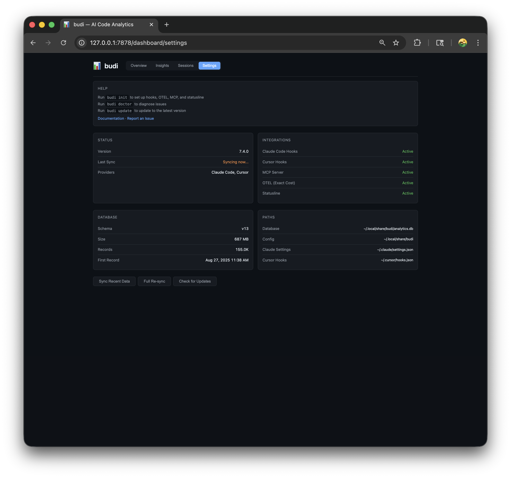

# budi

[](https://github.com/siropkin/budi/actions/workflows/ci.yml)
[](https://github.com/siropkin/budi/releases/latest)
[](https://github.com/siropkin/budi/blob/main/LICENSE)
[](https://github.com/siropkin/budi)

**Local-first cost analytics for AI coding agents.** See where your tokens and money go across Claude Code, Cursor, and more.

```bash
brew install siropkin/budi/budi && budi init
```

No cloud. No uploads. Everything stays on your machine.

<p align="center">
  
</p>

<details>
<summary>More dashboard pages</summary>

**Insights** — cache efficiency, session cost curve, tool usage, subagent costs

<p align="center">
  
</p>

**Sessions** — searchable session list with drill-down to individual messages and session health

<p align="center">
  
</p>

**Settings** — integration status, database info, sync controls

<p align="center">
  
</p>

</details>

## What it does

- Tracks tokens, costs, and usage per message across AI coding agents
- **Exact cost** via OpenTelemetry for Claude Code (includes thinking tokens)
- Attributes cost to repos, branches, tickets, and custom tags
- **Session health** — detects context bloat, cache degradation, cost acceleration, and retry loops with actionable, provider-aware tips
- Web dashboard at `http://localhost:7878/dashboard`
- Live cost + health status line in Claude Code and Cursor
- Background sync every 30 seconds — no workflow changes needed
- ~6 MB Rust binary, minimal footprint

## Platforms

budi targets **macOS**, **Linux** (glibc), and **Windows 10+**. Prebuilt release binaries are published for macOS (Intel + Apple Silicon), Linux (x86_64 + aarch64 glibc), and Windows x86_64. On Windows ARM64, the installer currently uses the x86_64 binary via emulation. Paths follow OS conventions (`HOME` / `USERPROFILE`, data under `~/.local/share/budi` on Unix and `%LOCALAPPDATA%\budi` on Windows). Daemon port takeover after upgrade uses `lsof`/`ps`/`kill` on Unix and **PowerShell `Get-NetTCPConnection`** plus `taskkill` on Windows (requires PowerShell, which is default on supported Windows versions).

## Supported agents

| Agent | Status | How |
|-------|--------|-----|
| **Claude Code** | Supported | OpenTelemetry (exact cost) + JSONL transcripts + hooks |
| **Cursor** | Supported | Usage API + hooks (local transcript fallback when API/auth unavailable) |
| **Copilot CLI, Codex CLI, Cline, Aider, Gemini CLI** | Planned | |

## Contributing

See [CONTRIBUTING.md](CONTRIBUTING.md) for local setup, quality checks, and PR workflow.

To report a bug or request a feature, open a GitHub issue using the repository templates so maintainers get reproducible details quickly.

## Install

Use Homebrew if you have it. Otherwise use the shell script (macOS/Linux) or PowerShell script (Windows). Build from source only if you want to contribute.

**Homebrew (macOS / Linux):** requires [Homebrew](https://brew.sh/)

```bash
brew install siropkin/budi/budi && budi init
```

**Shell script (macOS / Linux):** requires `curl` and `tar` (glibc-based systems only; Alpine/musl users should build from source)

```bash
curl -fsSL https://raw.githubusercontent.com/siropkin/budi/main/scripts/install-standalone.sh | bash
```

**Windows (PowerShell):** requires PowerShell 5.1+

```powershell
irm https://raw.githubusercontent.com/siropkin/budi/main/scripts/install-standalone.ps1 | iex
```

Windows notes: binaries install to `%LOCALAPPDATA%\budi\bin`. Stopping or upgrading the daemon uses `taskkill` (or PowerShell) instead of Unix `pkill`. On startup, budi-daemon asks PowerShell for listeners on its port and terminates another `budi-daemon` if present. PATH is updated in the user environment — restart your terminal after install.

**From source:** requires [Rust toolchain](https://rustup.rs/)

```bash
git clone https://github.com/siropkin/budi.git && cd budi && ./scripts/install.sh
```

Windows source build (PowerShell):

```powershell
git clone https://github.com/siropkin/budi.git
cd budi
cargo build --release --locked
$BinDir = Join-Path $env:LOCALAPPDATA "budi\bin"
New-Item -ItemType Directory -Path $BinDir -Force | Out-Null
Copy-Item .\target\release\budi.exe $BinDir -Force
Copy-Item .\target\release\budi-daemon.exe $BinDir -Force
& (Join-Path $BinDir "budi.exe") init
```

**Or paste this into your AI coding agent:**

> Install budi from https://github.com/siropkin/budi following the install instructions in the README

`budi init` behavior by install method:

| Method | Runs `budi init` automatically? |
|---|---|
| Homebrew (`brew install ...`) | No — run `budi init` manually |
| Standalone shell script (`curl ... \| bash`) | Yes |
| Standalone PowerShell script (`irm ... \| iex`) | Yes |
| From source (`./scripts/install.sh`) | Yes |

If you install with Homebrew, run `budi init` right after `brew install`.

**One install on PATH.** Do not mix Homebrew with `~/.local/bin` (macOS/Linux) or with `%LOCALAPPDATA%\budi\bin` (Windows): you can end up with different `budi` and `budi-daemon` versions and confusing restarts. Keep a single install directory ahead of others on `PATH` (or remove duplicates). `budi init` warns if it detects multiple binaries.

`budi init` starts the daemon, syncs existing data, and now **prompts you to choose integrations** (Claude hooks/MCP/OTEL/statusline, Cursor hooks/extension, Starship prompt module). In non-interactive mode it uses safe defaults. You can also choose explicitly with flags like `--with`, `--without`, and `--integrations all|none|auto`. **Restart Claude Code and Cursor** after install to activate hook/config changes. The daemon uses port 7878 by default — customize `daemon_port` in the **repo-local** `config.toml` under `<budi-home>/repos/<repo-id>/config.toml` (run `budi doctor` inside the repo to see the exact path).

To install a specific version, set the `VERSION` environment variable: `VERSION=v7.1.0 curl -fsSL ... | bash` (or `$env:VERSION="v7.1.0"` on PowerShell).

Run `budi doctor` to verify everything is set up correctly.

## Status line

Budi adds a live cost display to Claude Code (optional in `budi init`):

`🟢 budi · $4.92 session · session healthy`

The `coach` preset shows your current session cost plus a health indicator. When Budi spots a problem, the short tip explains what to do next:

`🟡 budi · $12.50 session · Context growing — /compact soon`

New sessions start green — the default is always positive:

`🟢 budi · $0.42 session · new session`

Customize slots in `~/.config/budi/statusline.toml`:

```toml
slots = ["today", "week", "month", "branch"]
```

Available slots: `today`, `week`, `month`, `session`, `branch`, `project`, `provider`.

For Starship integration, add to `~/.config/starship.toml`:

```toml
[custom.budi]
command = "budi statusline --format=starship"
when = "curl -sf http://localhost:7878/health >/dev/null 2>&1"
format = "[$output]($style) "
style = "cyan"
shell = ["sh"]
```

## Cursor extension

Budi includes a Cursor/VS Code extension that shows session health and cost in the status bar and a side panel. It can be installed during `budi init` and later via `budi integrations install --with cursor-extension`.

The status bar shows today's sessions with health at a glance (`🟢 3 🟡 1 🔴 0`). Click it to open the health panel with session details, vitals, and tips. Active session tracking works via hooks — no manual setup needed.

**Manual install** (if auto-install was skipped or you want to rebuild):

```bash
cd extensions/cursor-budi
npm ci
npm run lint
npm run format:check
npm run test
npm run build
npx vsce package --no-dependencies -o cursor-budi.vsix
cursor --install-extension cursor-budi.vsix --force
```

Then reload Cursor: **Cmd+Shift+P** → **Developer: Reload Window**.

## Update

```bash
budi update                      # downloads latest release, migrates DB, restarts daemon
budi update --version 7.1.0     # update to a specific version
```

Works for all installation methods — automatically detects Homebrew and runs `brew upgrade` when appropriate. Update refreshes integrations you previously enabled (stored in `~/.config/budi/integrations.toml`).

## Integrations

Manage integrations anytime (especially if you skipped some during first init):

```bash
budi integrations list
budi integrations install --with claude-code-hooks --with claude-code-otel
budi integrations install --with cursor-extension
budi integrations install --with starship
```

**Restart Claude Code and Cursor** after updating to pick up any changes.

## CLI

```bash
budi init                     # start daemon, install hooks, sync data
budi init --integrations none # initialize data/daemon without editor integrations
budi init --with starship     # install an extra integration during init
budi integrations list        # show what is installed vs available
budi integrations install ... # install integrations later
budi open                     # open web dashboard
budi doctor                   # check health: daemon, database, config
budi doctor --deep            # run full SQLite integrity_check (slower)
budi stats                    # usage summary with cost breakdown
budi stats --models           # model usage breakdown
budi stats --projects         # repos ranked by cost
budi stats --branches         # branches ranked by cost
budi stats --branch <name>    # cost for a specific branch
budi stats --tag ticket_id    # cost per ticket
budi stats --tag ticket_prefix # cost per team prefix
budi sync                     # sync recent data (last 30 days)
budi sync --all               # load full history (all time)
budi sync --force             # re-ingest all data from scratch (use after upgrades)
budi repair                   # repair schema drift + run migration checks
budi update                   # check for updates (auto-detects Homebrew)
budi update --version <name>  # update to a specific version
budi health                   # show session health vitals for most recent active session
budi health --session <id>    # health vitals for a specific session
budi uninstall                # remove hooks, status line, config, and data
budi uninstall --keep-data    # uninstall but keep analytics database
budi mcp-serve                # run MCP server (used by Claude Code, not called directly)
```

All data commands support `--period today|week|month|all` and `--format json`.

## Tags & cost attribution

Assistant messages are tagged with core attribution keys: `provider`, `model`, `ticket_id`, `ticket_prefix`, `activity`, `composer_mode`, `permission_mode`, `duration`, `tool`, `tool_use_id`, `user_email`, `platform`, `machine`, `user`, `git_user`.

Conditional tags:
- `cost_confidence` is added when `cost_cents` is present.
- `speed` is added only for non-`standard` speed modes.

Identity tag semantics:
- `platform`: OS platform (`macos`, `linux`, `windows`)
- `machine`: host/machine name
- `user`: local OS username
- `git_user`: Git identity (`user.name`/`user.email` fallback)

`repo_id` and `git_branch` are stored as canonical message/session fields (not tags), so repo/branch analytics stay single-source and do not double-count.

Add custom tags in `~/.config/budi/tags.toml`:

```toml
[[rules]]
key = "team"
value = "platform"
match_repo = "github.com/org/repo"

[[rules]]
key = "team"
value = "backend"
match_repo = "*Backend*"
```

## MCP server

Budi includes an MCP (Model Context Protocol) server so AI agents can query your cost data and configure budi directly from conversation. Installed automatically by `budi init` into `~/.claude/settings.json`.

**Example prompts:**
- "What's my AI coding cost this week?"
- "Which model is costing me the most?"
- "Show me cost per branch this month"
- "Set up tag rules for my team repos"

**Available tools (15):**

| Tool | Description |
|------|-------------|
| `get_cost_summary` | Total cost, tokens, messages for a period |
| `get_model_breakdown` | Cost breakdown by model |
| `get_project_costs` | Cost breakdown by repo/project |
| `get_branch_costs` | Cost breakdown by git branch |
| `get_branch_detail` | Detailed stats for a specific branch |
| `get_tag_breakdown` | Cost breakdown by any tag key |
| `get_provider_breakdown` | Cost breakdown by agent (Claude Code, Cursor) |
| `get_tool_usage` | Tool call frequency + MCP server stats |
| `get_activity` | Daily activity chart data |
| `get_config` | Current budi configuration |
| `set_tag_rules` | Configure custom tag rules |
| `set_statusline_config` | Configure statusline slots |
| `sync_data` | Trigger data sync |
| `get_status` | Daemon health, schema, sync state |
| `session_health` | Session health vitals, tips, and overall state |

All analytics tools accept a `period` parameter: `today`, `week`, `month`, `all` (default: `month`).

The MCP server is a thin HTTP client to the daemon — it never touches the database directly. Communication uses stdio (JSON-RPC), and all logging goes to stderr.

## Session health

Budi monitors four vitals for every active session and turns them into plain-language tips.

The scoring is intentionally conservative:
- New sessions start **green** — the default is always positive. Vitals only turn yellow or red when there is clear evidence of a problem.
- It measures the current working stretch, so a `/compact` resets context-based checks.
- It looks at the active model stretch for cache reuse, so model switches do not poison the whole session.
- Cost acceleration uses per-user-turn costs when hook data provides prompt boundaries, and falls back to per-reply costs otherwise.
- When `budi health` runs without `--session`, it picks the latest session by assistant activity first, then falls back to session timestamps.
- It prefers concrete next steps over internal jargon.

Tips are provider-aware: Claude Code suggestions mention `/compact` or `/clear`, Cursor suggestions point you toward a fresh composer session, and unknown providers receive neutral advice. Different providers may intentionally get different recommendations for the same health issue.

| Vital | What it detects | Yellow | Red |
|-------|----------------|--------|-----|
| **Context Growth** | Context size is growing enough to add noise | 3x+ growth with meaningful absolute growth | 6x+ growth with large absolute context size |
| **Cache Reuse** | Recent cache reuse is low for the active model stretch | Below 60% recent reuse | Below 35% recent reuse |
| **Cost Acceleration** | Later turns/replies cost much more than earlier ones | 2x+ growth and meaningful cost per unit | 4x+ growth and high cost per unit |
| **Retry Loops** | Agent is stuck in a failing tool loop | One suspicious retry loop | Repeated or severe retry loops |

Health state appears in the status line, the Cursor extension panel, and the session detail page in the dashboard. Yellow means "pay attention soon"; red means "intervene now or start fresh."

## Privacy

Budi is 100% local — no cloud, no uploads, no telemetry. All data stays on your machine (`~/.local/share/budi/` on Unix, `%LOCALAPPDATA%\budi` on Windows). Budi only stores metadata: timestamps, token counts, model names, and costs. It **never** reads, stores, or transmits file contents, prompt text, or AI responses.

## How it works

A lightweight Rust daemon (port 7878) receives real-time OpenTelemetry events, syncs JSONL transcripts, and processes hook events — merging all sources into a single SQLite database. The CLI is a thin HTTP client — all queries go through the daemon.

## Details

<details>
<summary>How budi compares</summary>

| | budi | ccusage | Claude `/cost` |
|---|---|---|---|
| Multi-agent support | **Yes** (Claude Code + Cursor) | Claude Code only | Claude Code only |
| Exact cost (incl. thinking tokens) | **Yes** (via OTEL) | No | Approximate |
| Cost history | **Per-message + daily** | Per-session | Current session |
| Web dashboard | **Yes** | No | No |
| Status line + session health | **Yes** (with actionable tips) | No | No |
| Per-repo breakdown | **Yes** | No | No |
| Cost attribution (branch/ticket) | **Yes** | No | No |
| Privacy | 100% local | Local | Built-in |
| Setup | `budi init` | `npx ccusage` | Built-in |
| Built with | Rust | TypeScript | — |

</details>

<details>
<summary>Architecture</summary>

```
┌──────────┐    HTTP     ┌──────────────┐    SQLite    ┌──────────┐
│ budi CLI │ ──────────▶ │ budi-daemon  │ ───────────▶ │  budi.db │
└──────────┘             │  (port 7878) │              └──────────┘
                         │              │                    ▲
┌──────────┐    HTTP     │  - OTEL recv │    Pipeline       │
│ Dashboard│ ──────────▶ │  - 30s sync  │ ──────────────────┘
└──────────┘             │  - analytics │    Extract → Normalize
                         │  - hooks     │      → Enrich → Load
┌──────────┐             │  - queue     │
│ ingest   │◀───────────▶│  drainer     │
│ queue DB │   durable   │              │
└──────────┘             └──────────────┘
┌──────────┐    HTTP     └──────────────┘
│ MCP      │ ──────────▶ (stdio JSON-RPC, 15 tools)
│ Server   │  thin client
└──────────┘
                          ▲   ▲   ▲   ▲
             OTEL ────────┘   │   │   └───── Cursor API
         (exact cost)         │   │       (usage events)
                   JSONL ─────┘   │
                 (transcripts)    │
                                  │
┌──────────┐  hooks    ┌──────────┐  hooks
│ Claude   │ ──────────│ budi hook│──────── Cursor
│ Code     │  (stdin)  │  (CLI)   │ (stdin)
└──────────┘           └──────────┘
  │
  └── OTLP HTTP/JSON ──▶ POST /v1/logs (auto-configured)
```

The daemon is the single source of truth — the CLI never opens the database directly. Realtime hooks/OTEL payloads are written to a durable local queue first, then drained into analytics in bounded retries. Each message row is enriched from multiple sources: OTEL provides exact cost, JSONL provides context (parent messages, working directory), and hooks provide session metadata (repo, branch, user). For Cursor, Usage API sync is primary, with local transcript parsing as a fallback when API auth/network is unavailable.

**Data model** — eight tables, six data entities + two supporting:

| Table | Role |
|-------|------|
| **messages** | Single cost entity — all token/cost data lives here (one row per API call) |
| **sessions** | Lifecycle context (start/end, duration, mode) without mixing cost concerns |
| **hook_events** | Raw event log for tool stats and MCP tracking |
| **otel_events** | Raw OpenTelemetry event storage for debugging/audit |
| **tags** | Flexible key-value pairs per message (repo, ticket, activity, user, etc.) |
| **sync_state** | Tracks incremental ingestion progress per file for progressive sync |
| **message_rollups_hourly** | Derived hourly aggregates (provider/model/repo/branch/role) for low-latency analytics reads |
| **message_rollups_daily** | Derived daily aggregates for summary/filter scans |

`messages` remains the source of truth; rollup tables are derived caches maintained incrementally during ingest/update/delete.

</details>

<details>
<summary>Privacy & Retention</summary>

budi is local-first, but you can now enforce tighter storage controls for raw payloads and session metadata.

**Privacy mode (`BUDI_PRIVACY_MODE`):**

| Value | Behavior |
|------|----------|
| `full` (default) | Store raw values as-is |
| `hash` | Hash sensitive fields (for example `user_email`, `cwd`, and workspace paths) before storage |
| `omit` | Do not store sensitive raw/session fields |

**Retention controls:**

| Env var | Default | Scope |
|--------|---------|-------|
| `BUDI_RETENTION_RAW_DAYS` | `30` | `hook_events.raw_json`, `otel_events.raw_json`, `sessions.raw_json` |
| `BUDI_RETENTION_SESSION_METADATA_DAYS` | `90` | `sessions.user_email`, `sessions.workspace_root` |

Use `off` to disable a retention window for a category.

Retention cleanup runs automatically after sync and queued realtime ingestion processing.

**At-rest protection (SQLCipher strategy):**
- Current default uses bundled SQLite (WAL) for broad compatibility and easy installs.
- If you need encrypted-at-rest local DBs (shared/managed machines), use one of these strategies:
  - build budi against SQLCipher-enabled SQLite (`libsqlite3-sys` SQLCipher build),
  - or place the budi data directory on an encrypted volume (FileVault, LUKS, BitLocker).
- SQLCipher integration is feasible but has tradeoffs (key management UX, packaging complexity, migration path from existing plaintext DBs), so default remains plain SQLite for now.

</details>

<details>
<summary>Hooks</summary>

Both Claude Code and Cursor support lifecycle hooks that budi uses for real-time event capture. Hooks are installed automatically by `budi init` into `~/.claude/settings.json` and `~/.cursor/hooks.json`. They are non-blocking (`async: true`) and wrapped with `|| true` so that budi can never interfere with your coding agent — even if budi crashes or is uninstalled.

| Data | Claude Code | Cursor |
|------|-------------|--------|
| Session start/end | SessionStart, SessionEnd | sessionStart, sessionEnd |
| Tool usage + duration | PostToolUse | postToolUse |
| Context pressure | PreCompact | preCompact |
| Subagent tracking | SubagentStop | subagentStop |
| Prompt classification | UserPromptSubmit | — |
| File modifications | — | afterFileEdit |

</details>

<details>
<summary>OpenTelemetry (Claude Code)</summary>

When Claude Code has telemetry enabled, it sends OTLP HTTP/JSON events to budi's daemon for every API request. This provides **exact cost data** including thinking tokens — closing the accuracy gap that JSONL-only parsing has (JSONL's `output_tokens` doesn't include thinking tokens).

`budi init` automatically configures the following env vars in `~/.claude/settings.json`:

```json
{
  "env": {
    "CLAUDE_CODE_ENABLE_TELEMETRY": "1",
    "OTEL_EXPORTER_OTLP_ENDPOINT": "http://127.0.0.1:7878",
    "OTEL_EXPORTER_OTLP_PROTOCOL": "http/json",
    "OTEL_METRICS_EXPORTER": "otlp",
    "OTEL_LOGS_EXPORTER": "otlp"
  }
}
```

All telemetry stays local — it goes directly from Claude Code to budi's daemon on localhost. No data leaves your machine.

**How the data merges:** Each API call produces data from three sources. OTEL provides exact cost and token counts (including thinking tokens). JSONL provides message context (parent UUID, working directory, git branch). Hooks provide session metadata (repo, branch, user email). Budi merges all three into a single message row — regardless of which source arrives first.

**Cost confidence levels:**

| Level | Source | Accuracy |
|-------|--------|----------|
| `otel_exact` | OTEL `api_request` event | Exact (includes thinking tokens) |
| `exact` | Cursor Usage API / Claude Code JSONL tokens | Exact tokens, calculated cost |
| `estimated` | JSONL tokens x model pricing | ~92-96% accurate (missing thinking tokens) |

Messages with `otel_exact` or `exact` confidence show exact cost in the dashboard. Estimated costs are prefixed with `~`.

**If you already use OTEL elsewhere:** If `OTEL_EXPORTER_OTLP_ENDPOINT` is already set to a non-localhost URL, `budi init` won't overwrite it. You can use an [OTEL Collector](https://opentelemetry.io/docs/collector/) with multiple exporters to send data to both budi and your existing endpoint.

</details>

<details>
<summary>Daemon API</summary>

The daemon runs on `http://127.0.0.1:7878` and exposes a REST API.
Privileged routes are loopback-only (`127.0.0.1` / `::1`): all `/admin/*` endpoints plus `POST /sync`, `POST /sync/all`, and `POST /sync/reset`.

**System:**

| Method | Endpoint | Description |
|--------|----------|-------------|
| GET | `/health` | Health check |
| POST | `/sync` | Sync recent data (last 30 days, loopback-only) |
| POST | `/sync/all` | Load full transcript history (loopback-only) |
| POST | `/sync/reset` | Wipe sync state + full re-sync (loopback-only) |
| GET | `/sync/status` | Syncing flag + last_synced + ingest queue backlog/failed metrics |
| POST | `/hooks/ingest` | Receive hook events |
| GET | `/health/integrations` | Hooks/MCP/OTEL/statusline status + DB stats |
| GET | `/health/check-update` | Check for updates via GitHub |
| POST | `/v1/logs` | OTLP logs ingestion (durable-queued, then background processed) |
| POST | `/v1/metrics` | OTLP metrics ingestion (stub for future use) |

**Analytics:**

| Method | Endpoint | Description |
|--------|----------|-------------|
| GET | `/analytics/summary` | Cost and token totals |
| GET | `/analytics/filter-options` | Filter values for providers/models/projects/branches |
| GET | `/analytics/messages` | Message list (paginated, searchable) |
| GET | `/analytics/messages/{message_uuid}/detail` | Full detail for a specific message |
| GET | `/analytics/projects` | Repos ranked by usage |
| GET | `/analytics/branches` | Cost per git branch |
| GET | `/analytics/branches/{branch}` | Cost for a specific branch |
| GET | `/analytics/cost` | Cost breakdown |
| GET | `/analytics/models` | Model usage breakdown |
| GET | `/analytics/providers` | Per-provider breakdown |
| GET | `/analytics/activity` | Token activity over time |
| GET | `/analytics/tags` | Cost breakdown by tag |
| GET | `/analytics/tools` | Tool usage frequency and duration |
| GET | `/analytics/mcp` | MCP server usage stats |
| GET | `/analytics/statusline` | Status line data |
| GET | `/analytics/cache-efficiency` | Cache hit rates and savings |
| GET | `/analytics/session-cost-curve` | Cost per message by session length |
| GET | `/analytics/cost-confidence` | Breakdown by cost confidence level |
| GET | `/analytics/subagent-cost` | Subagent vs main agent cost |
| GET | `/analytics/sessions` | Session list (paginated, searchable) |
| GET | `/analytics/sessions/{id}` | Session metadata and aggregate stats |
| GET | `/analytics/sessions/{id}/messages` | Messages for a specific session |
| GET | `/analytics/sessions/{id}/curve` | Session input token growth curve |
| GET | `/analytics/sessions/{id}/hook-events` | Hook events linked to a session |
| GET | `/analytics/sessions/{id}/otel-events` | OTEL events linked to a session |
| GET | `/analytics/sessions/{id}/tags` | Tags for a specific session |
| GET | `/analytics/session-health` | Session health vitals and tips |
| GET | `/analytics/session-audit` | Session attribution/linking audit stats |
| GET | `/admin/providers` | Registered providers (loopback-only) |
| GET | `/admin/schema` | Database schema version (loopback-only) |
| POST | `/admin/migrate` | Run database migration (loopback-only) |
| POST | `/admin/repair` | Repair schema drift + run migration (loopback-only) |
| POST | `/admin/integrations/install` | Install/update integrations from daemon (loopback-only) |

Most endpoints accept `?since=<ISO>&until=<ISO>` for date filtering.

</details>

## Troubleshooting

**Dashboard shows no data:**
1. Run `budi doctor` to check health
2. Run `budi sync` to sync recent transcripts
3. For full history: `budi sync --all`
4. If schema drift is detected after upgrade: `budi repair`

**Daemon won't start:**
1. Check if port 7878 is in use: `lsof -i :7878`
2. Kill stale processes: `pkill -f "budi-daemon serve"`
3. Restart: `budi init`

Windows equivalent:
1. Check listeners: `Get-NetTCPConnection -LocalPort 7878 -State Listen`
2. Kill stale daemon: `taskkill /IM budi-daemon.exe /F`
3. Restart: `budi init`

**Hooks not working:**
1. Run `budi doctor` — it validates hook installation
2. Make sure you restarted Claude Code / Cursor after `budi init`
3. Re-install: `budi init` (safe to run multiple times)
4. Check hook delivery errors in `<budi-home>/hook-debug.log` (usually `~/.local/share/budi/hook-debug.log`)

**Status line not showing:**
1. Restart Claude Code after `budi init`
2. Check: `budi statusline` should output cost data

## Uninstall

```bash
budi uninstall          # stops daemon, removes hooks, status line, config, and data
```

`budi uninstall` removes hooks, status line, config, and data but **not** the binaries themselves. Remove binaries separately:

```bash
# Homebrew:
brew uninstall budi

# Shell script (macOS / Linux):
rm ~/.local/bin/budi ~/.local/bin/budi-daemon
# or use the full uninstall script:
curl -fsSL https://raw.githubusercontent.com/siropkin/budi/main/scripts/uninstall.sh | bash

# From source (cargo install):
cargo uninstall budi budi-daemon

# Windows (PowerShell):
irm https://raw.githubusercontent.com/siropkin/budi/main/scripts/uninstall-standalone.ps1 | iex
```

Options: `--keep-data` to preserve the analytics database and config, `--yes` to skip confirmation.

## Exit codes

`budi init` returns 0 on success, 2 on partial success (init completed but hooks had warnings), 1 on hard error.

## License

[MIT](LICENSE)
