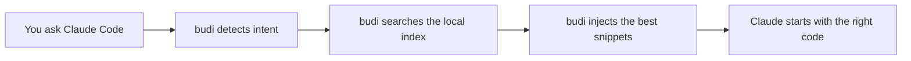
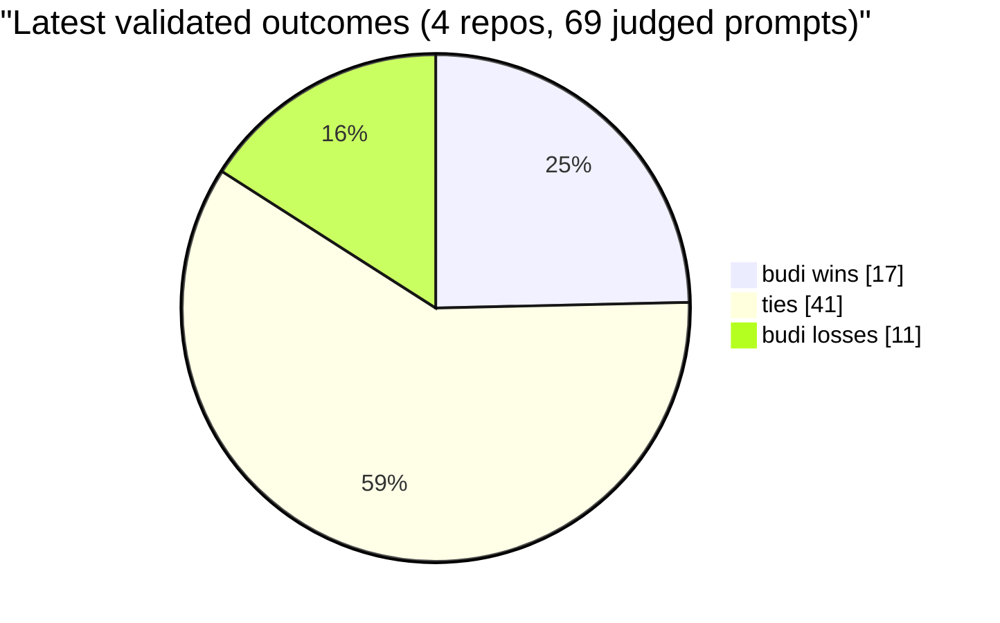

# budi

[](https://github.com/siropkin/budi/actions/workflows/ci.yml)
[](https://github.com/siropkin/budi/actions/workflows/release.yml)
[](https://github.com/siropkin/budi/blob/main/LICENSE)
[](https://github.com/siropkin/budi)

**The context buster for Claude Code.**

`budi` finds the code Claude is about to look for and injects it before Claude starts searching.

That means faster first useful answers, fewer wasted tool calls, lower token burn, and better grounding on medium and large repos.

Stop paying Claude to rediscover your codebase on every prompt.

- Local-first: your code stays on your machine
- Fast: retrieval runs in about 10ms
- Automatic: Claude Code hooks work in the background
- Practical: skip once with `@nobudi`, force once with `@forcebudi`

## Why it feels better

Without `budi`, Claude often spends its first few turns doing repo discovery: searching for files, opening imports, tracing the obvious path, and only then starting to reason.

With `budi`, the likely files are already in context when Claude sees your prompt.



## Latest A/B numbers

Across 4 open-source repos (72 prompts total), judged by an independent LLM:

- 5–24% lower cost
- Equal or better quality on the majority of prompts
- No regressions on prompts where budi skips injection
- Wins on targeted queries (symbol lookup, call tracing, config); ties on broad overview queries where baseline Claude is already strong



Full methodology, prompts, and per-prompt evidence live in `docs/benchmark.md`.

## Install in 60 seconds

1. Install the local binary:

```bash
./scripts/install.sh --from-release
# or build locally:
./scripts/install.sh
```

2. Install the Claude Code plugin:

```text
/plugin marketplace add siropkin/budi
/plugin install budi-hooks@budi-plugins
```

3. Enable `budi` in your repo:

```bash
cd /path/to/your/repo
budi init
budi index --hard --progress
```

Then use Claude Code normally. `budi` runs silently in the background.

## What happens on each prompt

1. `budi` intercepts your prompt through a Claude Code hook.
2. It figures out intent: symbol lookup, architecture question, call tracing, config hunt, and more.
3. It searches a local index using lexical, semantic, symbol, and graph signals.
4. It injects the best snippets into Claude's context.
5. Claude starts answering with the likely code already in view.

## Useful commands

```bash
budi index
budi index --hard --progress
budi repo status
budi repo search "payment validation"
budi repo preview "why is the payment form failing validation?"
```

For troubleshooting:

```bash
budi doctor
# deeper watcher/index diagnostics:
budi doctor --deep
```

## Prompt controls

Skip context injection for one prompt:

```text
@nobudi your prompt here
```

Force context injection for one prompt:

```text
@forcebudi your prompt here
```

## Docs

- Benchmark methodology: `docs/benchmark.md`
- Public evidence: `docs/benchmark-details.md`
- Configuration: `docs/configuration.md`
- Architecture: `docs/architecture.md`
- Installer details: `docs/installer.md`

## Privacy

Everything runs locally. No cloud index. No repo upload. No external retrieval service needed to do the core job.
