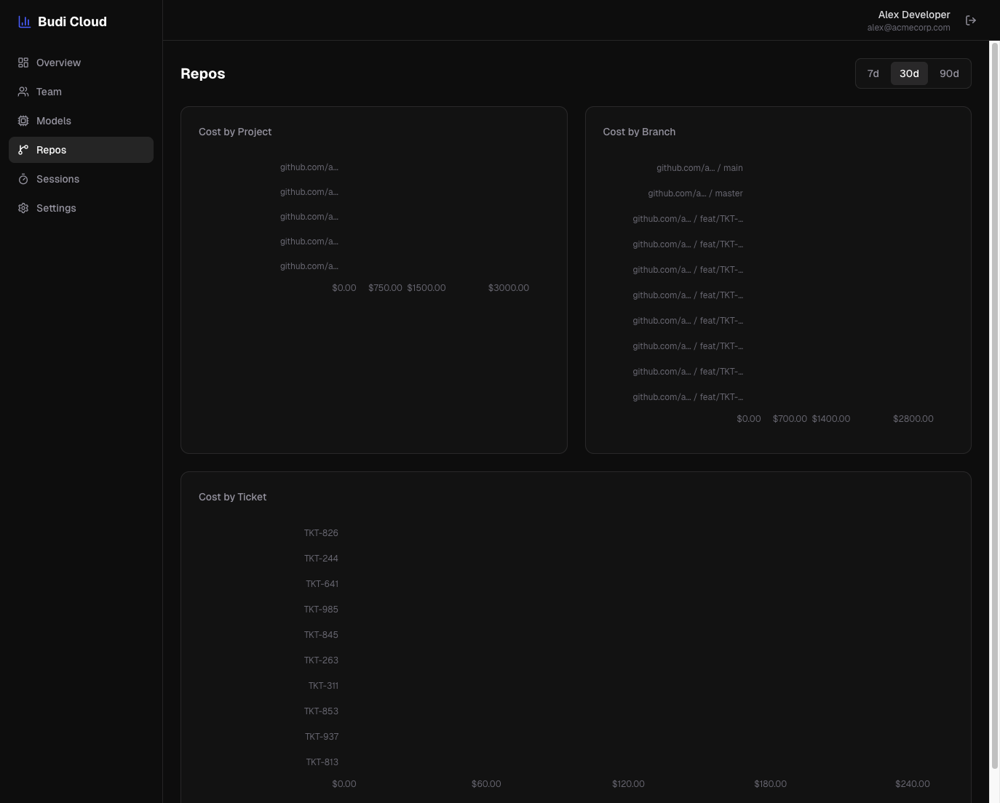

# budi

[](https://github.com/siropkin/budi/actions/workflows/ci.yml)
[](https://github.com/siropkin/budi/releases/latest)
[](https://github.com/siropkin/budi/blob/main/LICENSE)
[](https://github.com/siropkin/budi)

**Local-first cost analytics for AI coding agents.** See where your tokens and money go across Claude Code, Cursor, Codex, and Copilot CLI — broken down by repo, branch, ticket, and file.

```bash
brew install siropkin/budi/budi && budi init
```

Everything stays on your machine by default. Optional cloud sync pushes aggregated daily metrics to a team dashboard — prompts, code, and responses never leave your machine.

<p align="center">
  
</p>

<details>
<summary>Cloud dashboard screenshots</summary>

**Overview** — team-wide cost visibility
<p align="center">
  
</p>

**Repos & Tickets** — cost breakdown by project, branch, and ticket
<p align="center">
  
</p>

**Sessions** — recent sessions across the team
<p align="center">
  
</p>

</details>

## What budi does

- **Tracks every AI coding agent** — Claude Code, Cursor, Codex CLI, and Copilot CLI in one place
- **Per-message cost and tokens** — not just session totals; every API call attributed individually
- **Repo, branch, and ticket breakdown** — know which project, PR branch, or ticket is driving spend
- **Session health** — detects context bloat, cache degradation, and cost acceleration with actionable tips
- **Live status line** in Claude Code and Cursor showing rolling 1d / 7d / 30d spend
- **Team dashboard** at [app.getbudi.dev](https://app.getbudi.dev) — optional sync sends only aggregated metrics; prompts and code never leave your machine
- **~6 MB Rust binary**, zero config required, minimal footprint

## Ecosystem

| | |
|---|---|
| **[budi](https://github.com/siropkin/budi)** ← you are here | Core Rust daemon and CLI |
| **[budi-cloud](https://github.com/siropkin/budi-cloud)** | Team dashboard and ingest API at [app.getbudi.dev](https://app.getbudi.dev) |
| **[budi-cursor](https://github.com/siropkin/budi-cursor)** | VS Code / Cursor status bar extension |
| **[getbudi.dev](https://getbudi.dev)** | Website and documentation |

## Supported agents

| Agent | Status | How |
|---|---|---|
| **Claude Code** | Supported | Live JSONL transcript tailing |
| **Codex CLI** | Supported | Live transcript tailing |
| **Cursor** | Supported | Live tailing + Usage API reconciliation |
| **Copilot CLI** | Supported | Live transcript tailing |
| **Gemini CLI** | Deferred | Tracked in [#294](https://github.com/siropkin/budi/issues/294) |

All agents also support one-time historical import via `budi db import`.

## Install

**Homebrew (macOS / Linux)** — recommended

```bash
brew install siropkin/budi/budi && budi init
```

**Shell script (macOS / Linux)**

```bash
curl -fsSL https://raw.githubusercontent.com/siropkin/budi/main/scripts/install-standalone.sh | bash
```

**Windows (PowerShell)**

```powershell
irm https://raw.githubusercontent.com/siropkin/budi/main/scripts/install-standalone.ps1 | iex
```

> **Or paste this into your AI coding agent:**
> Install budi from https://github.com/siropkin/budi following the install instructions in the README

<details>
<summary>Build from source, Windows notes, version pinning</summary>

**From source** — requires [Rust toolchain](https://rustup.rs/)

```bash
git clone https://github.com/siropkin/budi.git && cd budi && ./scripts/install.sh
```

**Windows source build (PowerShell):**

```powershell
git clone https://github.com/siropkin/budi.git
cd budi
cargo build --release --locked
$BinDir = Join-Path $env:LOCALAPPDATA "budi\bin"
New-Item -ItemType Directory -Path $BinDir -Force | Out-Null
Copy-Item .\target\release\budi.exe $BinDir -Force
Copy-Item .\target\release\budi-daemon.exe $BinDir -Force
& (Join-Path $BinDir "budi.exe") init
```

Binaries install to `%LOCALAPPDATA%\budi\bin`. Restart your terminal after install.

**Version pinning:** set `VERSION=v8.2.1` before the curl command, or `$env:VERSION="v8.2.1"` on PowerShell.

**One install on PATH.** Do not mix Homebrew with `~/.local/bin` — mismatched `budi` and `budi-daemon` versions break daemon restarts. `budi init` warns if it detects duplicates.

</details>

## Quick start

```bash
# 1. Install and initialize (starts daemon, installs status line, detects agents)
brew install siropkin/budi/budi && budi init

# 2. Use your agent normally — budi tails its transcripts automatically
claude   # or: codex / cursor / gh copilot

# 3. Verify everything is working
budi doctor

# 4. See today's cost
budi status

# Optional: import past sessions
budi db import
```

`budi init` starts the daemon, installs the platform autostart service, and wires the Claude Code status line and Cursor extension. It does not patch shell profiles or editor settings. Run `budi doctor` any time to check health end-to-end.

## Common commands

```bash
budi status                  # daemon health + today's cost
budi stats                   # cost and token summary
budi stats projects          # repos ranked by cost
budi stats branches          # branches ranked by cost
budi stats tickets           # tickets ranked by cost
budi stats models            # model breakdown
budi stats files             # files ranked by cost
budi sessions                # recent sessions with cost and health
budi sessions <id>           # session detail: cost, models, health, tags
budi vitals                  # session health for the latest session
budi doctor                  # full health check
budi db import               # import historical transcripts (one-time backfill)
budi update                  # update to latest release
```

All commands support `--period today|week|month|all` and `--format json`. See the [full CLI reference](#full-cli-reference) below.

## Status line

`budi init` wires a live cost display into Claude Code and Cursor automatically (pass `--no-integrations` to skip).

```
budi · $1.24 1d · $8.50 7d · $32.10 30d
```

Windows show rolling 1d / 7d / 30d — not calendar reset at midnight. Customize via `~/.config/budi/statusline.toml`:

```toml
slots = ["1d", "7d", "30d"]   # default quiet preset
# preset = "coach"             # adds session cost + health tip
# preset = "full"              # session + health + rolling 1d total
```

Available slots: `1d`, `7d`, `30d`, `session`, `branch`, `project`, `health`.

## Cloud sync (optional)

Disabled by default. Get set up in two commands:

```bash
budi cloud init --api-key budi_your_key_here   # get your key at app.getbudi.dev → Settings
budi init                                      # restart daemon to pick up config
budi cloud status                              # confirm: state: ready
```

Only pre-aggregated daily rollups sync — prompts, code, and responses never leave your machine. See [Privacy](#privacy) for full details.

## Privacy

Budi is local-first. All data lives in `~/.local/share/budi/` (Unix) or `%LOCALAPPDATA%\budi` (Windows). The daemon reads the transcript files your agent already writes to disk and stores derived analytics: timestamps, token counts, model names, costs, and attribution tags. Prompts, code, and responses are never stored or transmitted.

Cloud sync (optional) sends only numeric aggregates — token counts, costs, model names, hashed repo IDs, branch names, and ticket IDs. Raw payloads, file contents, and email addresses are structurally excluded from every sync payload. See [ADR-0083](docs/adr/0083-cloud-ingest-identity-and-privacy-contract.md) for the full privacy contract.

## Troubleshooting

**No data after setup:**
1. `budi status` — check daemon health
2. `budi doctor` — verify transcript visibility
3. Send a prompt to your agent, then check `budi stats`
4. For historical data: `budi db import`

**Daemon won't start:**
```bash
lsof -i :7878              # check if port is in use
pkill -f "budi-daemon"     # kill stale process
budi init                  # restart
```
Windows: `Get-NetTCPConnection -LocalPort 7878 -State Listen` / `taskkill /IM budi-daemon.exe /F`

**Status line not showing in Claude Code:**
```bash
budi integrations list
budi integrations install --with claude-code-statusline
# then restart Claude Code
```

**Cursor extension offline or quiet:**
Run `budi doctor`, then **Budi: Refresh Status** in Cursor. Open a Cursor chat once so it creates its local session files, then recheck `budi status`.

**Upgraded from 8.0/8.1?** Run `budi doctor` — if it warns about proxy residue, run `budi init --cleanup`.

**Daemon doesn't survive reboots:** `budi autostart status` — if not installed, run `budi autostart install`.

## Uninstall

```bash
budi uninstall          # stops daemon, removes autostart, status line, config, and data
budi uninstall --keep-data  # preserve the analytics database
```

Remove binaries separately:
```bash
brew uninstall budi                            # Homebrew
rm ~/.local/bin/budi ~/.local/bin/budi-daemon  # shell script install
# Windows: irm https://raw.githubusercontent.com/siropkin/budi/main/scripts/uninstall-standalone.ps1 | iex
```

## Contributing

See [CONTRIBUTING.md](CONTRIBUTING.md) for local setup and PR workflow. Architecture and module boundaries are documented in [SOUL.md](SOUL.md). ADRs live in [`docs/adr/`](docs/adr/).

Quick validation: `cargo fmt --all && cargo clippy --workspace --all-targets --locked -- -D warnings && cargo test --workspace --locked`

## License

[MIT](LICENSE)

---

<details>
<summary id="full-cli-reference">Full CLI reference</summary>

**Launch and onboarding:**

```bash
budi init                          # start daemon + install autostart + show detected agents
budi init --cleanup                # review/remove managed 8.0/8.1 proxy residue
budi db import                     # one-time import of historical transcripts (shows per-agent progress)
budi db import --format json       # JSON output with per-agent file/message breakdown (scripting)
```

**Monitoring and analytics:**

```bash
budi status                        # quick overview: daemon and today's cost
budi stats                         # usage summary with cost breakdown
budi stats models                  # model usage breakdown
budi stats projects                # repos ranked by cost
budi stats projects --include-non-repo  # also show per-folder detail for non-repo work
budi stats branches                # branches ranked by cost
budi stats branch <name>           # cost for a specific branch
budi stats tickets                 # tickets ranked by cost
budi stats ticket <id>             # cost for a specific ticket, with per-branch breakdown
budi stats activities              # activities ranked by cost (bugfix, refactor, …)
budi stats activity <name>         # cost for a specific activity, with per-branch breakdown
budi stats files                   # files ranked by cost (repo-relative paths only)
budi stats file <path>             # cost for a specific file, with per-branch + per-ticket breakdown
budi stats --provider codex        # filter stats to a single provider
budi stats tag ticket_id           # cost per ticket value (raw tag view)
budi stats tag ticket_prefix       # cost per team prefix
budi stats files --limit 0         # show every row (default limit is 30)
budi sessions                      # list recent sessions with cost and health
budi sessions --ticket <id>        # sessions tagged with a ticket
budi sessions --activity <name>    # sessions tagged with an activity
budi sessions <id>                 # session detail: cost, models, health, tags, work outcome
budi vitals                        # session health vitals for most recent session
budi vitals --session <id>         # health vitals for a specific session
```

**Diagnostics and maintenance:**

```bash
budi doctor                        # check health: daemon, tailer, schema, transcript visibility
budi doctor --deep                 # run full SQLite integrity_check (slower)
budi pricing status                # pricing manifest source, version, fetched-at, model count
budi pricing status --refresh      # trigger an immediate LiteLLM manifest refresh
budi pricing status --json         # same data in JSON
budi cloud init                    # generate ~/.config/budi/cloud.toml from a commented template
budi cloud init --api-key KEY      # write the key + enable sync in one step
budi cloud status                  # cloud sync readiness + last-synced-at + queued records
budi cloud sync                    # push queued local rollups to the cloud now
budi cloud reset                   # reset watermarks so the next sync re-uploads everything (org switch / data wipe)
budi autostart status              # check daemon autostart service
budi autostart install             # install the autostart service
budi autostart uninstall           # remove the autostart service
budi db import --force             # re-ingest all data from scratch
budi db repair                     # repair schema drift + run migration checks
budi db migrate                    # run database migration explicitly (usually automatic)
budi update                        # check for updates (auto-detects Homebrew)
budi update --version <name>       # update to a specific version
budi integrations list             # show what is installed vs available
budi integrations install          # install all recommended integrations
budi integrations install --with claude-code-statusline
budi integrations install --with cursor-extension
budi uninstall                     # remove status line, config, and data
budi uninstall --keep-data         # uninstall but keep analytics database
```

All data commands support `--period today|week|month|all` and `--format json`.

</details>

<details>
<summary>How budi compares</summary>

| | budi | ccusage | Claude `/cost` |
|---|---|---|---|
| Multi-agent support | **Yes** (Claude Code, Codex CLI, Cursor, Copilot CLI) | Claude Code only | Claude Code only |
| Live local transcript tailing | **Yes** | No | No |
| Cost history | **Per-message + daily** | Per-session | Current session only |
| Cloud team dashboard | **Yes** ([app.getbudi.dev](https://app.getbudi.dev)) | No | No |
| Status line + session health | **Yes** (with actionable tips) | No | No |
| Cost attribution (branch/ticket/file) | **Yes** | No | No |
| Privacy | Local-first, optional cloud sync (aggregates only) | Local | Built-in |
| Setup | `budi init` | `npx ccusage` | Built-in |
| Built with | Rust | TypeScript | — |

</details>

<details>
<summary>Architecture</summary>

```
┌──────────┐    HTTP     ┌──────────────┐    SQLite    ┌──────────┐
│ budi CLI │ ──────────▶ │ budi-daemon  │ ───────────▶ │  budi.db │
└──────────┘             │  (port 7878) │              └──────────┘
                         │              │                    ▲
                         │  - analytics │    Pipeline        │
                         │  - tailer    │ ───────────────────┘
                         │  - import    │    Extract → Normalize → Enrich → Load
                         └──────────────┘
                                ▲
       Claude/Codex/Copilot JSONL files  ──┐
       Cursor transcripts + Usage API       ├──▶ shared ingest pipeline
       Historical import (budi db import)  ──┘
```

A lightweight Rust daemon (port 7878) manages a single SQLite database. The daemon watches each provider's local transcript roots, tails incremental appends through the shared pipeline, and writes canonical `messages` + tag rows. The CLI is a thin HTTP client — it never touches the database directly.

**Data model:**

| Table | Role |
|---|---|
| **messages** | One row per API call — all token/cost data |
| **sessions** | Lifecycle context (start/end, duration, mode) |
| **tags** | Flexible key-value pairs per message |
| **sync_state** | Incremental ingestion progress + cloud sync watermarks |
| **message_rollups_hourly** | Derived hourly aggregates for fast reads |
| **message_rollups_daily** | Derived daily aggregates for summary scans |

See [SOUL.md](SOUL.md) for the full architecture, data flow, and module boundaries.

</details>

<details>
<summary>Daemon API</summary>

The daemon runs on `http://127.0.0.1:7878`. Privileged routes (`/admin/*`, `POST /sync*`) are loopback-only.

**System:**

| Method | Endpoint | Description |
|---|---|---|
| GET | `/health` | Health check |
| POST | `/sync` | Sync recent data (loopback-only) |
| POST | `/sync/all` | Load full transcript history (loopback-only) |
| POST | `/sync/reset` | Wipe sync state + full re-sync (loopback-only) |
| GET | `/sync/status` | Syncing flag + last_synced |

**Analytics:**

| Method | Endpoint | Description |
|---|---|---|
| GET | `/analytics/summary` | Cost and token totals |
| GET | `/analytics/messages` | Message list (paginated) |
| GET | `/analytics/projects` | Repos ranked by usage |
| GET | `/analytics/branches` | Cost per git branch |
| GET | `/analytics/tickets` | Cost per ticket |
| GET | `/analytics/activities` | Cost per activity bucket |
| GET | `/analytics/files` | Cost per repo-relative file |
| GET | `/analytics/models` | Model usage breakdown |
| GET | `/analytics/sessions` | Session list (paginated) |
| GET | `/analytics/sessions/{id}` | Session metadata and aggregate stats |
| GET | `/analytics/session-health` | Session health vitals and tips |
| GET | `/analytics/statusline` | Status line data (shared provider-scoped contract) |
| GET | `/analytics/cache-efficiency` | Cache hit rates and savings |
| GET | `/pricing/status` | Pricing manifest snapshot |
| POST | `/pricing/refresh` | Trigger immediate LiteLLM manifest refresh (loopback-only) |

Most endpoints accept `?since=<ISO>&until=<ISO>` for date filtering. Full endpoint list including admin and cloud routes is in [SOUL.md](SOUL.md).

</details>
