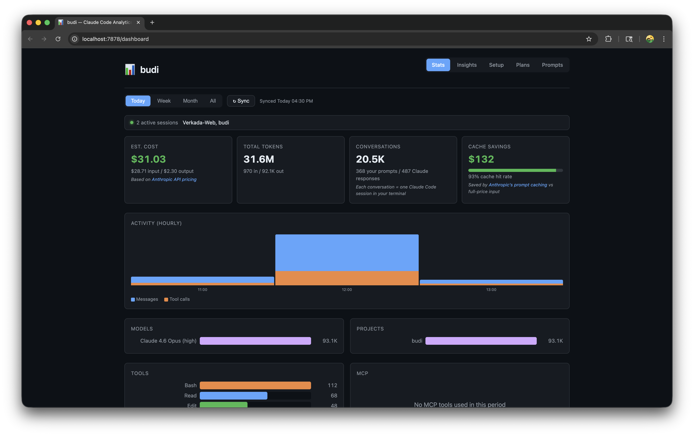
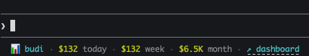

# budi

[](https://github.com/siropkin/budi/actions/workflows/ci.yml)
[](https://github.com/siropkin/budi/releases/latest)
[](https://github.com/siropkin/budi/blob/main/LICENSE)
[](https://github.com/siropkin/budi)

**WakaTime for AI coding agents.** See where your tokens go.

`budi` tracks every AI coding session — tokens, costs, prompts, and context composition — in a local-first analytics dashboard. No cloud. No uploads. Just insight into your AI spend.

### Agent integrations

budi is built on a pluggable provider architecture — each AI coding agent is a provider that's auto-detected at runtime. Today it fully supports Claude Code; more agents are coming.

| Agent | Status | Tokens | Cost | Sessions | Detection |
|-------|--------|--------|------|----------|-----------|
| **Claude Code** | Supported | Per-message | Per-model | Via hooks | `~/.claude/` |
| **Cursor** | In progress | — | — | Transcript count | `~/.cursor/` |
| **GitHub Copilot CLI** | Planned | | | | `~/.copilot/` |
| **Codex CLI** | Planned | | | | `~/.codex/` |
| **Cline** | Planned | | | | VS Code globalStorage |
| **Aider** | Planned | | | | `.aider.chat.history.md` |
| **Gemini CLI** | Planned | | | | `~/.gemini/` |

Agents are detected automatically — when a new agent's data directory appears, the next `budi sync` picks it up with zero config.

<p align="center">
  
</p>

<p align="center">
  
</p>

<p align="center">
  
</p>

## How it works

Budi has a pluggable **provider** architecture. Each AI coding agent is a provider that knows how to discover and parse that agent's local data. A lightweight Rust daemon (port 7878) syncs data from all detected providers into a single SQLite database, powering the dashboard and CLI.

**What budi does NOT collect:** file contents, prompt responses, or anything from the AI's output. Only metadata — timestamps, token counts, tool names, file paths, and costs.

### Claude Code (full support)

Budi uses [Claude Code hooks](https://docs.anthropic.com/en/docs/claude-code/hooks) — the official event system that lets external tools observe what Claude Code does in real time. When you run `budi init`, it registers hooks in `.claude/settings.local.json`:

| Hook | What budi captures |
|------|-------------------|
| **SessionStart** | New session begins — records session ID, repo, timestamp |
| **UserPromptSubmit** | Every prompt you send — prompt text, model, token counts |
| **PostToolUse** | File operations (Read, Write, Edit, Glob) — which files Claude touches |
| **SubagentStart** | Sub-agent spawns — tracks parallel work |
| **Stop** | Session ends — finalizes duration, total cost |

Hooks fire as HTTP calls to the daemon. Hook responses return in sub-millisecond time, so you never notice them. The ~6 MB binary handles everything: data collection, analytics, web dashboard, and CLI.

## Features

- **Built with Rust** — ~6 MB binary, sub-millisecond hook latency, minimal CPU/memory footprint
- **Local-first** — all data stays on your machine in a SQLite database, no cloud, no uploads
- **Automatic** — hooks run silently in the background, no workflow changes needed
- **Per-repo tracking** — automatically identifies repos by git remote, merges worktrees and clones
- **Session analytics** — prompt counts, token usage, and cost per session
- **Multi-agent** — supports Claude Code, Cursor, and more (auto-detected)
- **Status line** — live session stats in your Claude Code terminal
- **Web dashboard** — multi-page analytics UI at `http://localhost:7878/dashboard`
- **Insights** — actionable recommendations based on your usage patterns

## How budi compares

| | budi | ccusage | Sniffly | Claude `/cost` |
|---|---|---|---|---|
| Real-time tracking | **Yes** (hooks) | No (parses logs) | No (parses logs) | Live only |
| Multi-agent support | **Yes** (pluggable) | Claude Code only | Claude Code only | Claude Code only |
| Cost history | **Per-session + daily** | Per-session | Per-session | Current session |
| Web dashboard | **Yes** (5 pages) | No | Yes | No |
| Status line | **Yes** | No | No | No |
| Insights & recs | **Yes** | No | No | No |
| Per-repo breakdown | **Yes** | No | No | No |
| File activity tracking | **Yes** (PostToolUse) | No | No | No |
| Multi-machine sync | **Planned** | No | No | No |
| Privacy | 100% local | Local | Local | Built-in |
| Setup | `budi init` | `npx ccusage` | `sniffly init` | Built-in |
| Built with | Rust | TypeScript | Python | — |

## Install

### Quick start (paste into your AI coding agent)

> Install budi from https://github.com/siropkin/budi following the install instructions in the README

Your AI agent will clone the repo, run the installer, and set up your project automatically.

### Manual install

**Step 1 — Install binaries**

macOS / Linux:
```bash
curl -fsSL https://raw.githubusercontent.com/siropkin/budi/main/scripts/install-standalone.sh | sh
```

Windows (PowerShell):
```powershell
irm https://raw.githubusercontent.com/siropkin/budi/main/scripts/install-standalone.ps1 | iex
```

Or build from source (requires Rust toolchain):

```bash
git clone https://github.com/siropkin/budi.git && cd budi && ./scripts/install.sh
```

**Step 2 — Set up hooks**

Global (recommended — works for all repos and worktrees):
```bash
budi init --global
```

Or per-repo:
```bash
cd /path/to/your/repo
budi init
```

This installs Claude Code hooks, starts the daemon, and adds the status line to your Claude Code settings. Restart Claude Code so hook settings take effect.

**Step 3 — Use Claude Code normally.** Budi tracks your sessions in the background.

## Status line

Budi adds a live status line to Claude Code that shows key metrics at a glance. It is installed automatically when you run `budi init`.

<p align="center">
  
</p>

### Fields

| Field | Description |
|-------|-------------|
| **Model** | Active Claude model (e.g. `Claude 4 Opus`) |
| **ctx** | Context window usage — green (<60%), yellow (60–79%), red (80%+) |
| **session** | Cost of the current session (real-time from Claude Code) |
| **today** | Total cost across all sessions today (from budi daemon) |
| **5h** | 5-hour rate limit usage (Pro/Max plans only) — yellow at 50%+, red at 80%+ |
| **↗ dashboard** | Clickable link to open the web dashboard |

When no session data is available yet, the status line shows `✓ tracking` to confirm budi is active.

### Manual install / reinstall

If you skipped `budi init` or need to reinstall the status line:

```bash
budi statusline --install
```

This writes the status line config to `~/.claude/settings.json`. Restart Claude Code to activate.

## Web dashboard

Run `budi dashboard` to open the web UI in your browser, or click the dashboard link in the status line.

| Page | What it shows |
|------|---------------|
| **Stats** | Cost, tokens, activity chart, model breakdown, projects, tools, MCP servers, sessions |
| **Insights** | Recommendations, session patterns, tool diversity, daily cost trend, config health |
| **Setup** | Config files, memory, plugins, permissions |
| **Plans** | Searchable plan files with titles extracted from markdown headings |
| **Prompts** | Searchable prompt history (last 500 entries) |

## CLI commands

```bash
budi init                     # set up hooks, daemon, and status line in the current repo
budi init --global            # install hooks globally (all repos and worktrees)
budi doctor                   # check installation health
budi dashboard                # open the web dashboard in the browser
budi update                   # check for updates and install the latest version
budi stats                    # token usage summary (--period today|week|month|all)
budi stats --session <id>     # per-session detail
budi stats --files            # repositories ranked by usage
budi cost                     # estimated cost breakdown by model
budi models                   # model usage breakdown
budi sessions                 # list sessions with stats
budi plugins                  # installed Claude Code plugins
budi projects                 # repositories ranked by usage
budi insights                 # actionable recommendations
budi sync                     # sync Claude Code transcripts into the analytics database
budi statusline               # print the status line (used internally by Claude Code)
budi statusline --install     # install status line in ~/.claude/settings.json
```

All data commands support `--period today|week|month|all` and `--json` for scripting:

```bash
budi cost --period today --json    # pipe to jq, scripts, or dashboards
budi sessions --json | jq '.[0]'  # get latest session as JSON
```

## Roadmap

- **More agents** — Cursor, Copilot CLI, Codex CLI, Cline, Aider, Gemini CLI (see [agent integrations](#agent-integrations) above)
- **Cross-agent dashboard** — unified view across all AI coding tools
- **Token estimation** — approximate token counts for agents that don't log them
- **Multi-machine sync** — aggregate stats across devices

## Privacy

Everything runs locally. No cloud services. No data leaves your machine. Budi only stores metadata (timestamps, token counts, file paths, costs) — never file contents or prompt responses.

## License

[MIT](LICENSE)
