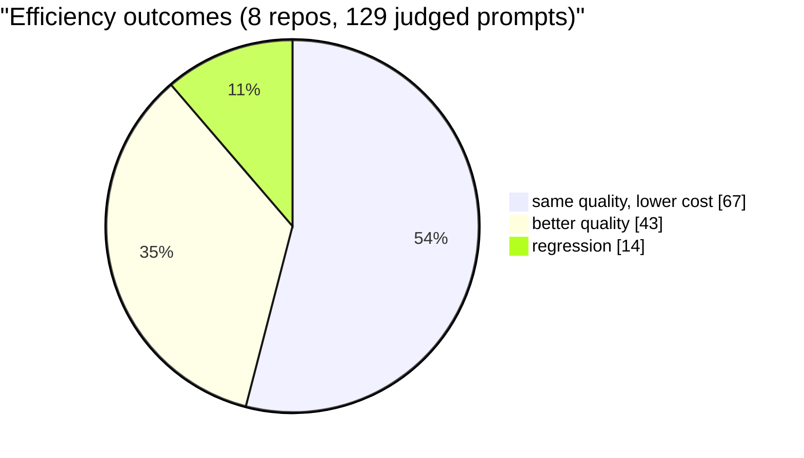

# budi

[](https://github.com/siropkin/budi/actions/workflows/ci.yml)
[](https://github.com/siropkin/budi/actions/workflows/release.yml)
[](https://github.com/siropkin/budi/blob/main/LICENSE)
[](https://github.com/siropkin/budi)

**The context buster for Claude Code.**

`budi` finds the code Claude is about to look for and injects it before Claude starts searching.

That means faster first useful answers, fewer wasted tool calls, lower token burn, and better grounding on medium and large repos.

Stop paying Claude to rediscover your codebase on every prompt.

- Local-first: your code stays on your machine
- Fast: retrieval runs in about 10ms
- Automatic: Claude Code hooks work in the background
- Practical: skip once with `@nobudi`, force once with `@forcebudi`

## Why it feels better

Without `budi`, Claude often spends its first few turns doing repo discovery: searching for files, opening imports, tracing the obvious path, and only then starting to reason.

With `budi`, the likely files are already in context when Claude sees your prompt.


## Latest A/B numbers

Across 8 open-source repos (129 judged prompts), compared by an independent LLM judge:

- **3–32% lower cost** on most repos (up to +6% on repos where budi adds quality)
- **89% regression-free** — same or better quality on 115/129 judged prompts
- FastAPI: 100% non-regression with 11 quality wins; Terraform: 83%, −32% cost
- Remaining 14 regressions are mild (Q −1) from HNSW variance on generic symbol names

budi's goal is to deliver the same answer quality at lower cost by pre-injecting the right context. Ties (same quality, less cost) are the primary success metric; quality wins are a bonus.



Full methodology, prompts, and per-prompt evidence live in `docs/benchmark.md`.

## Install in 60 seconds

1. Install the local binary:

```bash
./scripts/install.sh --from-release
# or build locally:
./scripts/install.sh
```

2. Install the Claude Code plugin:

```text
/plugin marketplace add siropkin/budi
/plugin install budi-hooks@budi-plugins
```

3. Enable `budi` in your repo:

```bash
cd /path/to/your/repo
budi init --index
```

Then use Claude Code normally. `budi` runs silently in the background.

## What happens on each prompt

1. `budi` intercepts your prompt through a Claude Code hook.
2. It figures out intent: symbol lookup, architecture question, call tracing, config hunt, and more.
3. It searches a local index using lexical, semantic, symbol, and graph signals.
4. It injects the best snippets into Claude's context.
5. Claude starts answering with the likely code already in view.

## Useful commands

```bash
budi repo status
budi repo search "payment validation"
budi repo preview "why is the payment form failing validation?"
budi index --hard --progress
```

For troubleshooting:

```bash
budi doctor
# deeper watcher/index diagnostics:
budi doctor --deep
```

## Prompt controls

Skip context injection for one prompt:

```text
@nobudi your prompt here
```

Force context injection for one prompt:

```text
@forcebudi your prompt here
```

## Docs

- Benchmark methodology: `docs/benchmark.md`
- Public evidence: `docs/benchmark-details.md`
- Configuration: `docs/configuration.md`
- Architecture: `docs/architecture.md`
- Installer details: `docs/installer.md`

## How budi compares

| | budi | context-mode | Claude Context Local | GitNexus |
|---|---|---|---|---|
| **Approach** | Pre-injects code before Claude searches | Compresses tool output after Claude searches | Semantic search via MCP (on demand) | Knowledge graph + MCP |
| **Integration** | Claude Code hooks (automatic) | Claude Code hooks (intercept) | MCP tools (explicit) | MCP + hooks |
| **Retrieval** | 5-channel (lexical, vector, symbol, path, graph) with intent routing | BM25 with 4-layer fallback | FAISS vector search | BM25 + semantic + RRF |
| **A/B validated** | 8 repos, 111 prompts, 91% non-regression | No | No | No |
| **Language** | Rust (single binary) | TypeScript (npm) | Python | TypeScript |
| **Privacy** | 100% local | 100% local | 100% local | 100% local |

budi is complementary with output-compression tools like context-mode. Use budi to inject the right code, and context-mode to compress verbose tool results.

## Privacy

Everything runs locally. No cloud index. No repo upload. No external retrieval service needed to do the core job.
